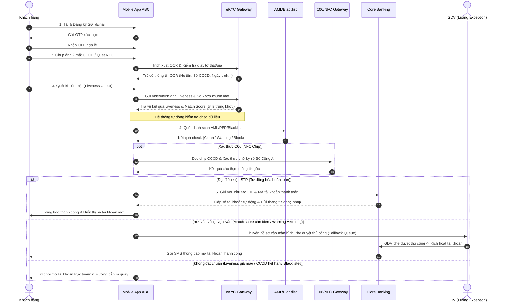

# TÀI LIỆU PHÂN TÍCH YÊU CẦU NGHIỆP VỤ (BRD)
## QUY TRÌNH MỞ TÀI KHOẢN TRỰC TUYẾN (eKYC) - ABC BANK

**Vai trò:** Senior Business Analyst (10 năm kinh nghiệm trong lĩnh vực FinTech / Ngân hàng số)  
**Dự án:** Số hóa quy trình mở tài khoản và phát hành thẻ trực tuyến  
**Mục tiêu chiến lược:** Đạt tỷ lệ tự động hóa tối đa (**Straight-Through Processing - STP**), hướng tới **"Zero Manual Operation"** (không cần sự can thiệp thủ công của giao dịch viên trong luồng chuẩn).

---

## 1. Tác Nhân Hệ Thống (Actors)

Trong hệ thống eKYC của ABC Bank, các tác nhân (Actors) tham gia trực tiếp hoặc gián tiếp bao gồm:

| Tác nhân | Loại | Mô tả |
| :--- | :--- | :--- |
| **Khách hàng mới (Prospect Customer)** | Primary Actor | Người dùng chưa có tài khoản tại ABC Bank, thực hiện đăng ký qua Mobile Banking App. |
| **Hệ thống eKYC (eKYC Engine)** | System | Hệ thống xử lý OCR (nhận diện ký tự), Liveness Check (chống giả mạo khuôn mặt) và Face Matching (đối chiếu khuôn mặt). |
| **Hệ thống Core Banking (Core Bank)** | System | Hệ thống quản lý tài khoản của ngân hàng, chịu trách nhiệm sinh số tài khoản, tạo Profile khách hàng (CIF) và kích hoạt dịch vụ. |
| **Hệ thống Phòng chống gian lận & Rửa tiền (AML/PEP/Blacklist System)** | System | Hệ thống quét danh sách đen (Blacklist), danh sách cấm vận, rửa tiền (AML - Anti-Money Laundering) và chính trị gia (PEP). |
| **Hệ thống Xác thực Bộ Công An / C06 (RAR/NFC System)** | System | Cổng kết nối xác thực thông tin căn cước công dân trực tiếp với Cơ sở dữ liệu Quốc gia về Dân cư (thông qua đọc NFC chip hoặc API được cấp phép). |
| **Giao dịch viên / Kiểm soát viên (Operations/Compliance Officer)** | Business Actor | Nhân sự ngân hàng chỉ tham gia xử lý các trường hợp ngoại lệ (Exceptions/Fallback) rơi vào luồng rà soát rủi ro thủ công. |

---

## 2. Luồng Nghiệp Vụ (Business Flow)

### 2.1. Sơ đồ quy trình tổng quan (Sequence Diagram)



### 2.2. Chi tiết các bước thực hiện nghiệp vụ

1. **Bước 1: Đăng ký ban đầu & Xác thực OTP**
   * Khách hàng tải App, nhập Số điện thoại và Email.
   * Hệ thống kiểm tra số điện thoại (chưa từng đăng ký tại ABC Bank) và gửi mã SMS OTP. Khách hàng nhập OTP để xác thực quyền sở hữu thiết bị.
2. **Bước 2: Thu thập thông tin định danh (CCCD)**
   * Khách hàng chụp ảnh mặt trước và mặt sau của CCCD (hoặc quét chip NFC đối với CCCD gắn chip).
   * Hệ thống OCR tự động nhận diện và bóc tách các trường thông tin: Số CCCD, Họ và tên, Ngày sinh, Giới tính, Quê quán, Địa chỉ thường trú, Ngày hết hạn.
   * Hệ thống thực hiện kiểm tra bảo an trên ảnh chụp (kiểm tra vân hoa, dấu mộc, phát hiện ảnh chụp lại qua màn hình, ảnh bị cắt góc, photocopy).
3. **Bước 3: Liveness Check & Face Matching**
   * Khách hàng thực hiện quét khuôn mặt theo thời gian thực (Liveness Check - di chuyển khuôn mặt theo hướng dẫn: quay trái, quay phải, nhìn thẳng, mỉm cười).
   * Thuật toán AI kiểm tra để đảm bảo đối tượng là thực thể sống (không phải ảnh tĩnh, video phát lại, hoặc mặt nạ 3D).
   * Thực hiện Face Match: So sánh ảnh chân dung trích xuất từ CCCD (hoặc ảnh gốc từ chip NFC) với ảnh chụp Liveness thực tế để tính toán tỷ lệ trùng khớp (Similarity Score).
4. **Bước 4: Đối chiếu chéo & Kiểm tra rủi ro (AML/Blacklist)**
   * Hệ thống gửi thông tin khách hàng lên Core để kiểm tra trùng lặp thông tin (CIF trùng).
   * Chạy kiểm tra qua hệ thống AML/PEP và danh sách Blacklist nội bộ/quốc tế để sàng lọc rủi ro.
5. **Bước 5: Xử lý phê duyệt tự động (Straight-Through Processing - STP)**
   * **Điều kiện STP:** Điểm Face Match >= 85%, Liveness PASS, Giấy tờ hợp lệ (không quá hạn, không phát hiện dấu hiệu giả mạo), AML/PEP sạch (Clean).
   * Hệ thống tự động gọi API Core Banking để khởi tạo CIF mới, mở tài khoản thanh toán, và gửi SMS thông báo số tài khoản và thông tin kích hoạt cho khách hàng.
   * **Điều kiện Fallback (Rà soát thủ công):** Điểm Face Match nằm trong khoảng [70% - 85%), hoặc OCR cảnh báo thông tin mờ/xước nhưng các yếu tố khác đều PASS. Hệ thống chuyển hồ sơ sang hàng đợi phê duyệt của Giao dịch viên (SLA phê duyệt < 15 phút).
   * **Điều kiện Từ chối:** Điểm Face Match < 70%, Liveness FAIL, phát hiện giấy tờ giả mạo, hoặc khách hàng nằm trong danh sách đen AML.

---

## 3. Yêu Cầu Chức Năng (Functional Requirements)

Hệ thống eKYC cần đáp ứng các nhóm chức năng chính sau:

### 3.1. Nhóm chức năng Đăng ký & Xác thực (Registration & Authentication)
* **F-REG-01:** Cho phép người dùng nhập Số điện thoại và Email để khởi tạo quy trình.
* **F-REG-02:** Gửi mã OTP xác thực qua SMS và xác minh tính hợp lệ của OTP (thời gian hiệu lực 2 phút, giới hạn nhập sai tối đa 3 lần).
* **F-REG-03:** Kiểm tra số điện thoại xem đã tồn tại Profile khách hàng trên hệ thống ABC Bank chưa để tránh đăng ký trùng.

### 3.2. Nhóm chức năng Trích xuất Giấy tờ tùy thân (OCR Engine & NFC Reader)
* **F-OCR-01:** Hướng dẫn người dùng chụp ảnh chân thực mặt trước/sau của CCCD (có khung căn chỉnh, tự động chụp khi ảnh nét).
* **F-OCR-02:** Tự động trích xuất các trường thông tin chữ và số trên CCCD bằng công nghệ OCR với độ chính xác cao.
* **F-OCR-03:** Đọc dữ liệu từ Chip CCCD qua giao tiếp NFC (đối với thiết bị hỗ trợ NFC) và giải mã thông tin đã được ký số bởi Bộ Công An.
* **F-OCR-04:** Phát hiện chất lượng ảnh (mờ, lóa sáng, mất góc, che khuất) và hiển thị cảnh báo yêu cầu chụp lại ngay lập tức.

### 3.3. Nhóm chức năng Nhận diện Khuôn mặt (Biometrics & Liveness)
* **F-BIO-01:** Thực hiện Liveness Check 3D (yêu cầu khách hàng cử động nhẹ theo chỉ dẫn ngẫu nhiên của app) để phòng chống giả mạo bằng ảnh/video.
* **F-BIO-02:** Tính toán độ tương đồng (Similarity Score) giữa ảnh khuôn mặt chụp Liveness và ảnh chân dung trên CCCD.

### 3.4. Nhóm chức năng Kiểm tra Tuân thủ & Rủi ro (Compliance & Anti-Fraud)
* **F-RSC-01:** Tự động tra cứu thông tin khách hàng qua danh sách AML/PEP/Blacklist của ngân hàng.
* **F-RSC-02:** Đối chiếu chéo thông tin OCR của CCCD với cơ sở dữ liệu quốc gia (nếu có kết nối API).

### 3.5. Nhóm chức năng Tạo tài khoản tự động (STP Account Issuance)
* **F-STP-01:** Tự động tạo mã CIF (Customer Information File) trên Core Banking khi hồ sơ eKYC đạt chuẩn phê duyệt tự động.
* **F-STP-02:** Tự động cấp số tài khoản thanh toán theo dải số định sẵn của ABC Bank.
* **F-STP-03:** Kích hoạt dịch vụ E-Banking và gửi SMS mật khẩu khởi tạo lần đầu cho khách hàng.

### 3.6. Nhóm chức năng Xử lý Ngoại lệ (Manual Review Portal - Back-office)
* **F-MAN-01:** Hiển thị danh sách hồ sơ cần phê duyệt thủ công (Fallback Queue) cho Giao dịch viên kèm theo lý do cần rà soát (ví dụ: Match score cận biên).
* **F-MAN-02:** Cho phép Giao dịch viên phê duyệt (Approve) hoặc Từ chối (Reject) hồ sơ eKYC bị cảnh báo.

---

## 4. Yêu Cầu Phi Chức Năng (Non-Functional Requirements)

Để hệ thống hoạt động ổn định, bảo mật và mang lại trải nghiệm xuất sắc cho khách hàng, các tiêu chí phi chức năng sau cần được tuân thủ nghiêm ngặt:

### 4.1. Hiệu năng & Khả năng tải (Performance & Scalability)
* **N-PER-01 (Thời gian phản hồi):**
  * Thời gian xử lý OCR trích xuất thông tin giấy tờ: **<= 2.0 giây**.
  * Thời gian xử lý Liveness Check & Face Match: **<= 3.0 giây**.
  * Tổng thời gian từ lúc khách hàng gửi bước xác thực cuối đến khi hiển thị số tài khoản (STP): **<= 10 giây**.
* **N-PER-02 (Khả năng chịu tải - Concurrency):** Hệ thống eKYC Gateway phải chịu tải tối thiểu **200 TPS (Transactions Per Second)** ở điều kiện bình thường và khả năng scale tự động lên **1000 TPS** trong các chiến dịch marketing cao điểm.

### 4.2. Bảo mật & Bảo vệ dữ liệu cá nhân (Security & Compliance)
* **N-SEC-01 (Mã hóa dữ liệu):** Toàn bộ dữ liệu truyền tải giữa thiết bị di động của khách hàng và hệ thống Backend phải được mã hóa qua giao thức HTTPS (TLS 1.3). Dữ liệu nhạy cảm (số CCCD, ảnh chân dung, sinh trắc học) lưu trữ trong cơ sở dữ liệu phải được mã hóa ở mức độ cao (AES-256).
* **N-SEC-02 (Bảo vệ thông tin cá nhân - Decree 13/2023/NĐ-CP):** Tuân thủ Nghị định 13/2023/NĐ-CP về bảo vệ dữ liệu cá nhân. Không lưu trữ ảnh chụp giấy tờ và khuôn mặt trực tiếp trên bộ nhớ đệm của thiết bị di động (Local Cache) sau khi đã đẩy lên Server thành công.
* **N-SEC-03 (Masking dữ liệu):** Trên giao diện màn hình Mobile App và Portal duyệt hồ sơ, các thông tin nhạy cảm (như 6 số giữa của CCCD) phải được ẩn đi bằng ký tự `*` (ví dụ: `0371xxxx5678`), trừ khi nhân sự có thẩm quyền được cấp quyền xem chi tiết.

### 4.3. Độ sẵn sàng & Khả năng khôi phục (Reliability & Availability)
* **N-AVA-01 (Độ sẵn sàng):** Hệ thống eKYC hoạt động liên tục 24/7/365 với độ sẵn sàng dịch vụ tối thiểu **99.95% (Uptime)**.
* **N-AVA-02 (RTO & RPO):**
  * Thời gian khôi phục dịch vụ tối đa khi xảy ra sự cố (RTO): **<= 30 phút**.
  * Mức độ mất dữ liệu tối đa chấp nhận được (RPO): **<= 0 giây** (không mất mát giao dịch tài chính/đăng ký đang xử lý).

### 4.4. Trải nghiệm người dùng (UX/UI Usability)
* **N-UX-01 (Tỷ lệ hoàn thành nhiệm vụ):** Quy trình eKYC phải được thiết kế tinh giản tối đa, số bước thao tác không quá **5 bước**, đảm bảo tỷ lệ hoàn thành (Completion Rate) của khách hàng đạt trên **85%**.
* **N-UX-02 (Hỗ trợ người dùng):** Giao diện chụp ảnh/quét khuôn mặt phải có giọng nói hoặc hướng dẫn bằng hoạt ảnh sinh động (Animation), thân thiện với mọi đối tượng khách hàng kể cả người lớn tuổi.

---

## 5. Giả Định & Quy Tắc Nghiệp Vụ (Assumptions & Business Rules)

### 5.1. Các Giả định nghiệp vụ (Assumptions)
* **A-01:** Thiết bị di động của khách hàng có camera hoạt động tốt với độ phân giải tối thiểu 5MP và có kết nối internet ổn định (3G/4G/5G/Wifi).
* **A-02:** Các API tích hợp bên thứ ba (Dịch vụ SMS OTP, Cơ sở dữ liệu quốc gia C06, Đối tác eKYC Engine) luôn sẵn sàng với SLA cam kết đạt tối thiểu 99.9%.
* **A-03:** Khách hàng sử dụng giấy tờ gốc (CCCD còn hạn sử dụng), không bị rách nát, tẩy xóa hay mờ thông tin.

### 5.2. Quy tắc nghiệp vụ (Business Rules - BR)

```markdown
> [!IMPORTANT]
> Các quy tắc dưới đây là bắt buộc để đảm bảo tính pháp lý (tuân thủ Thông tư 16/2020/TT-NHNN của Ngân hàng Nhà nước) và giảm thiểu rủi ro vận hành.
```

* **BR-AGE (Độ tuổi hợp lệ):** Khách hàng đăng ký mở tài khoản trực tuyến phải là công dân Việt Nam đủ **18 tuổi trở lên** (tính theo ngày sinh trên CCCD đến ngày hiện tại).
* **BR-LIMIT (Hạn mức giao dịch eKYC):**
  * Theo Thông tư 16, các tài khoản mở bằng phương thức eKYC (chưa gặp mặt trực tiếp hoặc chưa xác thực qua NFC kết nối C06) sẽ bị giới hạn hạn mức giao dịch **không quá 100 triệu VND/tháng/khách hàng**.
  * Nếu khách hàng thực hiện xác thực qua **CCCD gắn chip bằng đầu đọc NFC** kết nối với Cơ sở dữ liệu Quốc gia, hạn mức giao dịch sẽ được tự động nâng lên theo chính sách tài khoản thông thường (không áp dụng hạn mức 100 triệu).
* **BR-MATCH (Ngưỡng khớp sinh trắc học):**
  * **Similarity Score >= 85%**: Đủ điều kiện phê duyệt tự động (STP).
  * **70% <= Similarity Score < 85%**: Chuyển luồng rà soát thủ công (Manual Review). Giao dịch viên sẽ kiểm tra trực quan hình ảnh chụp giấy tờ và video liveness để quyết định.
  * **Similarity Score < 70%**: Hệ thống tự động từ chối mở tài khoản trực tuyến.
* **BR-RETRY (Giới hạn thử lại eKYC):** Khách hàng chỉ được phép thực hiện quét khuôn mặt tối đa **3 lần** trong một phiên giao dịch. Nếu vượt quá, hệ thống sẽ khóa chức năng eKYC của thiết bị/SĐT đó trong vòng 24 giờ để phòng chống tấn công brute-force sinh trắc học.
* **BR-UNIQUE (Tính duy nhất của thông tin):** Mỗi số CCCD và mỗi số điện thoại chỉ được liên kết với duy nhất **1 mã CIF** đang hoạt động tại ABC Bank. Hệ thống sẽ chặn đăng ký nếu phát hiện CCCD hoặc Số điện thoại đã được sử dụng.
* **BR-AML (Quy tắc AML/Blacklist):** Nếu khách hàng nằm trong danh sách đen (Blacklist) hoặc danh sách PEP mức độ cao, hệ thống lập tức từ chối tự động (Auto-reject) mà không chuyển qua luồng duyệt thủ công của Giao dịch viên thông thường, đồng thời ghi nhận log gửi đến bộ phận Compliance.

---

## 6. Danh Sách User Story (Chuẩn Scrum)

Dưới đây là các User Story được viết theo chuẩn định dạng nhằm phục vụ cho đội ngũ Phát triển (Developers) và Kiểm thử (QA/QC):

### 6.1. Nhóm Đăng ký & OTP

#### **US-01: Xác thực Số điện thoại & Khởi tạo**
* **User Story:**  
  * **As a** Khách hàng mới của ABC Bank,  
  * **I want to** nhập số điện thoại và xác thực bằng mã SMS OTP trên ứng dụng di động,  
  * **So that** tôi có thể xác minh thiết bị của mình và bắt đầu quy trình đăng ký tài khoản trực tuyến một cách an toàn.
* **Acceptance Criteria (Tiêu chí nghiệm thu):**
  1. *Scenario 1: SĐT hợp lệ và chưa từng đăng ký.* Hệ thống gửi SMS OTP chứa 6 chữ số đến số điện thoại người dùng nhập trong vòng 10 giây.
  2. *Scenario 2: SĐT đã tồn tại trên hệ thống.* Hiển thị thông báo thân thiện: "Số điện thoại này đã được đăng ký dịch vụ tại ABC Bank. Vui lòng đăng nhập hoặc sử dụng tính năng Quên mật khẩu".
  3. *Scenario 3: Nhập sai OTP.* Cho phép nhập sai tối đa 3 lần. Nhập sai lần thứ 4 sẽ khóa yêu cầu gửi OTP mới trong vòng 15 phút.
  4. *Scenario 4: Thời gian hiệu lực.* OTP phải hết hạn sau 120 giây kể từ khi gửi.

---

### 6.2. Nhóm Chụp ảnh & Trích xuất dữ liệu CCCD

#### **US-02: Chụp ảnh CCCD & Nhận diện OCR tự động**
* **User Story:**  
  * **As a** Khách hàng mới,  
  * **I want to** chụp ảnh mặt trước và mặt sau của thẻ CCCD bằng camera của điện thoại,  
  * **So that** hệ thống tự động điền các thông tin cá nhân của tôi mà tôi không cần phải gõ thủ công.
* **Acceptance Criteria:**
  1. *Scenario 1: Giao diện chụp ảnh.* Hiển thị khung chữ nhật căn chỉnh cho thẻ CCCD. Có hướng dẫn bật/tắt đèn flash và nhắc nhở không để ảnh bị chói sáng, mất góc.
  2. *Scenario 2: Trích xuất thông tin.* Hệ thống trích xuất thành công: Số CCCD, Họ tên, Ngày sinh, Giới tính, Quê quán, Địa chỉ thường trú, Ngày hết hạn với độ chính xác trường ký tự > 98%.
  3. *Scenario 3: Chất lượng ảnh kém.* Nếu ảnh bị mờ, lóa hoặc mất góc, hệ thống hiển thị cảnh báo lỗi cụ thể (ví dụ: "Ảnh bị lóa sáng, vui lòng chụp lại ở nơi có ánh sáng vừa phải") và yêu cầu chụp lại.
  4. *Scenario 4: Kiểm tra hạn dùng giấy tờ.* Nếu ngày hết hạn trên CCCD nhỏ hơn ngày hiện tại, hệ thống từ chối đăng ký và hiển thị cảnh báo giấy tờ không còn hiệu lực.

---

### 6.3. Nhóm Xác thực sinh trắc học

#### **US-03: Thực hiện Liveness Check & Face Match**
* **User Story:**  
  * **As a** Khách hàng mới,  
  * **I want to** thực hiện quét khuôn mặt chuyển động theo hướng dẫn trực tiếp của ứng dụng,  
  * **So that** ngân hàng xác thực được tôi là chủ nhân thực sự của thẻ CCCD và ngăn chặn kẻ xấu giả mạo tôi.
* **Acceptance Criteria:**
  1. *Scenario 1: Trải nghiệm quét khuôn mặt.* Giao diện hiển thị khung hình oval để người dùng đưa khuôn mặt vào. Có chỉ dẫn hoạt họa bằng hình ảnh/giọng nói (ví dụ: "Vui lòng quay đầu sang trái", "Hãy nhìn thẳng và cười").
  2. *Scenario 2: Phát hiện thực thể sống (Liveness PASS).* Hệ thống nhận diện được khuôn mặt là thực tế (không phải ảnh chụp lại, màn hình IPad hay mặt nạ). Nếu phát hiện nghi vấn, trả kết quả "Liveness Fail".
  3. *Scenario 3: Đối chiếu khuôn mặt (Face Matching).* Hệ thống so sánh khuôn mặt quét với ảnh chân dung trên CCCD:
     * Nếu tỷ lệ tương đồng (Similarity Score) >= 85%, ghi nhận trạng thái: **Match Approved**.
     * Nếu tỷ lệ từ 70% đến < 85%, ghi nhận trạng thái: **Match Warning (Chuyển duyệt tay)**.
     * Nếu tỷ lệ < 70%, ghi nhận trạng thái: **Match Rejected**.
  4. *Scenario 4: Số lần thử.* Nếu quét lỗi hoặc trượt quá 3 lần trong một phiên đăng ký, khóa luồng eKYC trong 24 giờ.

---

### 6.4. Nhóm Tự động hóa & Khởi tạo dịch vụ (STP)

#### **US-04: Xử lý STP & Cấp số tài khoản tự động**
* **User Story:**  
  * **As a** Khách hàng đăng ký tài khoản hợp lệ (mọi bước eKYC đều đạt chuẩn),  
  * **I want to** được cấp số tài khoản và thông tin đăng nhập Mobile Banking ngay lập tức trên app mà không phải đợi nhân viên duyệt,  
  * **So that** tôi có thể trải nghiệm các dịch vụ của ngân hàng ngay sau khi đăng ký.
* **Acceptance Criteria:**
  1. *Scenario 1: Hồ sơ đạt chuẩn STP.* Khi eKYC (OCR, Liveness, Face Match >= 85%) và kết quả kiểm tra AML đều hợp lệ (Clean):
     * Gọi API Core Banking tạo hồ sơ khách hàng (CIF) và số tài khoản thanh toán tự động trong vòng 3 giây.
     * Tạo tài khoản đăng nhập Mobile App (Username là số điện thoại của khách hàng).
     * Gửi SMS mật khẩu tạm thời cho khách hàng.
     * Hiển thị màn hình chúc mừng kèm thông tin Số tài khoản mới.
  2. *Scenario 2: Áp dụng hạn mức tự động.* Tài khoản mở qua eKYC thông thường được gán hạn mức mặc định tối đa 100 triệu VND/tháng. Nếu thực hiện qua xác thực NFC chip thành công, mở hạn mức tiêu chuẩn không giới hạn.

---

### 6.5. Nhóm Xử lý Ngoại lệ (Back-office)

#### **US-05: Hàng đợi phê duyệt thủ công (Fallback Processing)**
* **User Story:**  
  * **As an** Nhân viên phê duyệt/Giao dịch viên (Compliance/Operations Officer),  
  * **I want to** xem danh sách các hồ sơ eKYC bị rơi vào trạng thái cảnh báo (Warning) tại một cổng quản trị (Portal Backend),  
  * **So that** tôi có thể rà soát hồ sơ, đối chiếu hình ảnh thực tế và quyết định duyệt hay từ chối mở tài khoản cho khách hàng.
* **Acceptance Criteria:**
  1. *Scenario 1: Hiển thị hồ sơ cảnh báo.* Portal hiển thị chi tiết các hồ sơ có trạng thái cảnh báo kèm theo nguyên nhân cụ thể (ví dụ: "Face Match Score: 78%", "Ảnh chụp CCCD bị nghi ngờ mờ góc").
  2. *Scenario 2: So sánh trực quan.* Giao diện hiển thị song song ảnh chụp CCCD của khách hàng, thông tin bóc tách OCR, ảnh chụp khuôn mặt từ luồng Liveness và video kiểm tra cử động khuôn mặt để Giao dịch viên đối chứng trực giác.
  3. *Scenario 3: Phê duyệt/Từ chối hồ sơ.* 
     * Nếu chọn **Duyệt (Approve)**: Hệ thống kích hoạt API tạo CIF và Số tài khoản trên Core, tự động gửi SMS thông báo cho khách hàng.
     * Nếu chọn **Từ chối (Reject)**: Hệ thống yêu cầu nhập lý do từ chối (ví dụ: "Giấy tờ bị hỏng", "Ảnh chụp không khớp") và gửi SMS/Email thông báo từ chối kèm hướng dẫn cụ thể cho khách hàng.

---

## 7. Danh Sách Use Case (Mô tả chi tiết luồng tương tác)

### **Use Case 1: Đăng ký mở tài khoản trực tuyến qua eKYC (Happy Path)**

* **Tên Use Case:** UC-01: Đăng ký mở tài khoản trực tuyến qua eKYC
* **Tác nhân chính (Primary Actor):** Khách hàng mới (Prospect Customer)
* **Tác nhân hỗ trợ (Supporting Actors):** Hệ thống eKYC, Hệ thống AML, Hệ thống Core Banking
* **Mô tả tóm tắt:** Khách hàng tải app ABC Bank, đăng ký số điện thoại, thực hiện chụp ảnh căn cước công dân và quét khuôn mặt. Hệ thống tự động kiểm duyệt thông tin và cấp số tài khoản tự động nếu không phát hiện bất thường.
* **Tiền điều kiện (Pre-conditions):** 
  * Khách hàng chưa có mã CIF hoặc tài khoản hoạt động tại ABC Bank.
  * Điện thoại khách hàng có kết nối mạng internet và camera hoạt động tốt.
* **Luồng xử lý chính (Main Flow):**
  1. Khách hàng mở ứng dụng ABC Bank và chọn nút "Đăng ký mở tài khoản trực tuyến".
  2. Khách hàng nhập Số điện thoại và Email.
  3. Hệ thống kiểm tra số điện thoại trên hệ thống dữ liệu khách hàng hiện tại:
     * Số điện thoại hợp lệ và chưa từng được sử dụng.
  4. Hệ thống gửi mã OTP qua tin nhắn SMS tới số điện thoại đăng ký.
  5. Khách hàng nhập chính xác mã OTP trên ứng dụng.
  6. Hệ thống hiển thị hướng dẫn chụp ảnh CCCD. Khách hàng chụp mặt trước và mặt sau của thẻ CCCD.
  7. Hệ thống eKYC thực hiện bóc tách thông tin bằng OCR và trả về thông tin trên màn hình để khách hàng kiểm tra lại (Họ tên, Ngày sinh, Số CCCD, Địa chỉ). Khách hàng xác nhận thông tin chính xác.
  8. Hệ thống yêu cầu quét khuôn mặt. Khách hàng thực hiện Liveness Check theo các yêu cầu chuyển động trên màn hình.
  9. Hệ thống eKYC đối chiếu ảnh Liveness với ảnh chân dung trên CCCD và đánh giá Liveness thành công (Face Match Score >= 85%).
  10. Hệ thống AML/Blacklist quét thông tin khách hàng và phản hồi kết quả "Sạch" (Clean).
  11. Hệ thống tự động gửi thông tin tạo CIF và kích hoạt tài khoản thanh toán trực tiếp lên hệ thống Core Banking.
  12. Core Banking tạo số tài khoản thanh toán mới thành công.
  13. Ứng dụng hiển thị màn hình chúc mừng kèm Số tài khoản mới, đồng thời gửi SMS thông báo mật khẩu đăng nhập E-banking cho khách hàng.
* **Luồng rẽ nhánh / Ngoại lệ (Alternative Flows / Exception Flows):**
  * **Alt Flow 3a: Số điện thoại đã tồn tại**
    * 3a.1. Hệ thống phát hiện số điện thoại đã được đăng ký profile tại ngân hàng.
    * 3a.2. Hệ thống hiển thị thông báo lỗi: "Số điện thoại đã tồn tại. Vui lòng đăng nhập hoặc liên hệ Hotline để được hỗ trợ" và kết thúc quy trình.
  * **Alt Flow 6a: Ảnh chụp CCCD không hợp lệ**
    * 6a.1. Ảnh chụp CCCD bị lóa sáng hoặc mất góc. Hệ thống OCR không thể nhận diện.
    * 6a.2. Hệ thống hiển thị thông báo lỗi chi tiết và yêu cầu khách hàng chụp lại giấy tờ.
  * **Alt Flow 9a: Face Match nằm trong vùng Warning (70% <= Match Score < 85%)**
    * 9a.1. Hệ thống ghi nhận trạng thái hồ sơ cần phê duyệt thủ công.
    * 9a.2. Hệ thống hiển thị màn hình thông báo cho khách hàng: "Thông tin đăng ký của Quý khách đang được bộ phận chuyên trách rà soát. Kết quả sẽ được gửi qua SMS trong vòng 15 phút."
    * 9a.3. Hệ thống đẩy hồ sơ đăng ký vào hàng đợi phê duyệt thủ công (Fallback Queue) dành cho Giao dịch viên (Xem tiếp UC-02).
  * **Alt Flow 9b: Face Match thất bại hoặc Liveness giả mạo (Score < 70%)**
    * 9b.1. Hệ thống ghi nhận phát hiện rủi ro cao hoặc không khớp khuôn mặt.
    * 9b.2. Hệ thống hiển thị màn hình từ chối: "Rất tiếc, ABC Bank chưa thể mở tài khoản trực tuyến cho Quý khách dựa trên thông tin được cung cấp. Vui lòng mang giấy tờ tùy thân gốc đến chi nhánh ABC Bank gần nhất để được hỗ trợ." và kết thúc quy trình.
  * **Alt Flow 10a: Khách hàng nằm trong danh sách đen (Blacklist)**
    * 10a.1. Hệ thống AML phát hiện thông tin trùng khớp với đối tượng trong danh sách cấm.
    * 10a.2. Hệ thống tự động từ chối mở tài khoản trực tuyến tương tự bước 9b.2 mà không gửi hồ sơ qua duyệt tay của GDV để đảm bảo an ninh bảo mật.
* **Hậu điều kiện (Post-conditions):**
  * Profile khách hàng (CIF) và số tài khoản thanh toán mới được mở thành công trên hệ thống Core Banking.
  * Dịch vụ Ngân hàng điện tử (E-banking) được kích hoạt và sẵn sàng sử dụng.

---

### **Use Case 2: Phê duyệt hồ sơ eKYC bị cảnh báo (Manual Approval Flow)**

* **Tên Use Case:** UC-02: Phê duyệt hồ sơ eKYC bị cảnh báo
* **Tác nhân chính (Primary Actor):** Giao dịch viên / Kiểm soát viên (Operations/Compliance Officer)
* **Tác nhân hỗ trợ (Supporting Actors):** Hệ thống Portal Back-office, Hệ thống Core Banking
* **Mô tả tóm tắt:** Giao dịch viên rà soát các hồ sơ mở tài khoản bằng eKYC không đạt chuẩn phê duyệt tự động (bị rơi vào trạng thái cảnh báo sinh trắc học hoặc OCR). Giao dịch viên kiểm tra bằng trực quan mắt thường và quyết định duyệt hoặc từ chối hồ sơ này.
* **Tiền điều kiện (Pre-conditions):** 
  * Giao dịch viên đã đăng nhập thành công vào hệ thống Portal Back-office và được cấp quyền kiểm soát eKYC (eKYC Officer).
  * Có hồ sơ eKYC đang ở trạng thái "Chờ phê duyệt thủ công" (Pending Manual Review) trong hàng đợi (Queue).
* **Luồng xử lý chính (Main Flow):**
  1. Giao dịch viên truy cập danh mục "Hàng đợi phê duyệt eKYC".
  2. Hệ thống hiển thị danh sách các hồ sơ đang chờ duyệt kèm lý do cảnh báo (ví dụ: "Tỷ lệ trùng khớp khuôn mặt đạt 75% - Cận biên").
  3. Giao dịch viên chọn một hồ sơ để kiểm tra chi tiết.
  4. Hệ thống hiển thị đầy đủ thông tin:
     * Dữ liệu bóc tách OCR của CCCD bên cạnh hình ảnh chụp thẻ thực tế (mặt trước + mặt sau).
     * Ảnh chân dung của khách hàng chụp tại bước Liveness Check bên cạnh ảnh thẻ CCCD.
     * Điểm đánh giá Liveness Check và điểm tương đồng khuôn mặt (Match Score).
     * Xem lại đoạn video ghi lại cử động khuôn mặt của khách hàng lúc xác thực thực thể sống.
  5. Giao dịch viên đối chiếu và xác nhận thông tin giấy tờ là chính xác, khuôn mặt thực tế trùng khớp với người trên thẻ CCCD.
  6. Giao dịch viên nhấn nút **"Phê duyệt (Approve)"** trên giao diện Portal.
  7. Hệ thống tự động thực hiện:
     * Gọi API Core Banking để đăng ký CIF và mở tài khoản mới cho khách hàng.
     * Gửi SMS thông tin đăng nhập Mobile App đến số điện thoại của khách hàng.
  8. Hệ thống chuyển trạng thái hồ sơ thành **"Approved"** (Đã phê duyệt thủ công) và ghi nhận log lịch sử thao tác của Giao dịch viên (Audit Trail).
* **Luồng rẽ nhánh / Ngoại lệ (Alternative Flows / Exception Flows):**
  * **Alt Flow 6a: Giao dịch viên từ chối phê duyệt hồ sơ**
    * 6a.1. Giao dịch viên nhận thấy ảnh thẻ và ảnh thật Liveness không phải cùng một người, hoặc thông tin giấy tờ bị rách nát, chỉnh sửa.
    * 6a.2. Giao dịch viên chọn nút **"Từ chối (Reject)"**.
    * 6a.3. Hệ thống bắt buộc Giao dịch viên chọn hoặc nhập lý do từ chối cụ thể (ví dụ: "Ảnh sinh trắc học không khớp với ảnh gốc CCCD").
    * 6a.4. Hệ thống chuyển trạng thái hồ sơ thành **"Rejected"** (Từ chối phê duyệt) và tự động gửi SMS thông báo từ chối mở tài khoản tới số điện thoại khách hàng, kèm theo lý do để khách hàng nắm rõ.
* **Hậu điều kiện (Post-conditions):**
  * Hồ sơ eKYC được giải quyết dứt điểm (chuyển sang trạng thái Approved hoặc Rejected).
  * Lịch sử tác động của Giao dịch viên được lưu trữ đầy đủ trong hệ thống phục vụ công tác đối soát và kiểm toán định kỳ.
